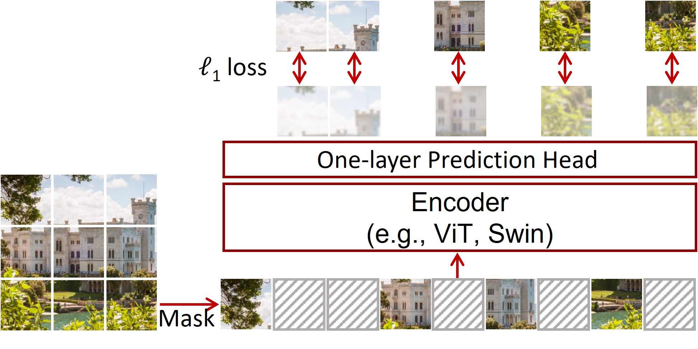

# Image Pretraining Practice Repository

This repository contains Python scripts I developed for my own practice in pre-training Transformer-based vision models (like ViT and Swin Transformer) on custom datasets. These scripts allow for pretraining on various configurations and, once trained, the model weights can be loaded into an AutoModelForImageClassification. Currently, the repository includes examples for:

* SimMIM (by Microsoft Research)
* MAE (by Facebook AI)

I created this setup to explore and experiment with image pretraining techniques firsthand.

# SimMIM
By Zhenda Xie*, Zheng Zhang*, Yue Cao*, Yutong Lin, Jianmin Bao, Zhuliang Yao, Qi Dai and Han Hu*.

This repo is the official implementation of ["SimMIM: A Simple Framework for Masked Image Modeling"](https://arxiv.org/abs/2111.09886).

This paper propsed a simple design for Masked Image Modeling.
While in NLP experts applied SSL techniques on huge amount of data and they came to a good generalization, in Computer vision this SSL was buried in recent years by Contrastive learning. The difficukty of applying SSL in CV can be explained by two different modalities:
* Pixles close to each other tend to be highly correlated, so we can done the task by duplicating pixels rather than semantic reasonong.
* Visual signals are raw and low-level, while topken are human generated and high level in terms of concepts.
* Visual signals are continous, while text tokens are discrete.

## Steps of SimMIM:
### 1. Random Masking of Input Image:
SimMIM applies a random masking strategy where parts of the input image are masked out, hiding specific regions from the model. A moderately large patch size is chosen for masking; for example, a patch size of 32x32 pixels(supports masked ration 10%-70%), as mentioned in the paper, while for path size of 8 the masked ratio should be as high as 80%. This masking helps the model learn to predict the missing parts, focusing on understanding and reconstructing image structure from context.
### 2. Linear Layer Regression to Raw Pixel Values:
To reconstruct the masked regions, SimMIM uses a linear layer that directly regresses the RGB pixel values of the masked patches. This regression task encourages the model to predict exact color values, allowing it to learn fine-grained details in addition to high-level features. The training objective is based on L1 loss, which measures the difference between predicted and actual pixel values, helping the model focus on accurate reconstruction.
### 3. Minimizing Complexity for Efficient Training:
SimMIM’s design is intentionally simple, avoiding complex architectural modifications or heavy reconstruction heads. This simplicity reduces computational overhead and allows for more efficient and fast training. By focusing on direct pixel regression with minimal additional processing, SimMIM maintains a lightweight and scalable approach to masked image modeling.

# Dataset
This model has been trained on ["CIFAR10"](https://huggingface.co/datasets/uoft-cs/cifar10).The CIFAR-10 dataset consists of 60000 32x32 colour images in 10 classes, with 6000 images per class, which has two columns(image and label) and 50k rows in training and 10k rows for testing. The dataset is divided into five training batches and one test batch, each with 10000 images. The test batch contains exactly 1000 randomly-selected images from each class. The training batches contain the remaining images in random order, but some training batches may contain more images from one class than another. Between them, the training batches contain exactly 5000 images from each class.
* label: 0-9 with the following correspondence 0 airplane 1 automobile 2 bird 3 cat 4 deer 5 dog 6 frog 7 horse 8 ship 9 truck

# My Dataset:
I am trying to fintune it on (Indina food dataset"}(https://huggingface.co/datasets/rajistics/indian_food_images). Whic has two fields and 5.33k rows on train and 941 rows on test.

